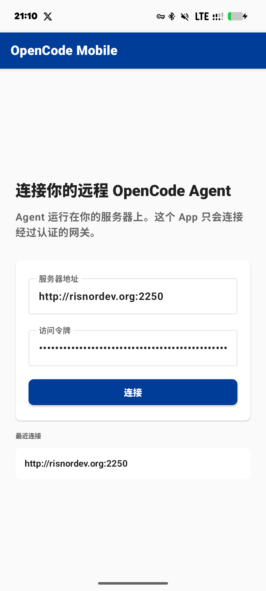

# OpenCode Mobile App

Native Android client for controlling remote OpenCode sessions through a self-hosted gateway.

OpenCode Mobile is designed for people who already run OpenCode on a server and want to keep coding sessions reachable from their phone without exposing the raw `opencode serve` endpoint directly to the internet. The Android app talks to [`opencode-mobile-agent`](https://github.com/Risaly-Noroki-Dev-Club/opencode-mobile-agent), an authenticated HTTP/SSE gateway that runs next to OpenCode on your own machine.

<p align="center">
  
</p>

## Repository Scope

This repository contains only the native Android app.

The companion server gateway lives here:

```text
https://github.com/Risaly-Noroki-Dev-Club/opencode-mobile-agent
```

## Status

OpenCode Mobile is currently an MVP/debug build. It is usable for testing and personal setups, but it is not yet a polished production release.

Current features:

- Connect to `opencode-mobile-agent` with bearer-token authentication.
- Read agent health from `/health`.
- List available projects from `/projects`.
- List historical sessions per project from `/sessions`.
- Create a new OpenCode session in a selected project directory.
- Reopen an existing session and continue chatting.
- Receive OpenCode events through `/opencode/event` SSE.
- Refresh assistant responses from session history when upstream streaming events are incomplete.
- Approve or reject OpenCode permission requests from the phone.
- View session diffs.
- Use the Navi bottom sheet for commands, prompt templates, and model selection.
- Manage providers and models from the mobile UI.
- Render Markdown responses, including code blocks, lists, links, inline code, and tables.
- English and Simplified Chinese localization.

Still planned:

- Multi-server management.
- Session search.
- Session deletion and renaming.
- Signed release builds.
- Message copy/share actions.
- Offline cache.
- Push notifications.

## Why a Gateway?

`opencode serve` already exposes a headless HTTP API, but the raw OpenCode server is best kept bound to localhost. The mobile agent adds a smaller remote boundary for phone access:

```text
Android App
  |
  | HTTPS / HTTP with bearer-token auth
  v
opencode-mobile-agent
  |
  | localhost HTTP / SSE
  v
opencode serve
```

The gateway can run behind your own HTTPS reverse proxy, VPN, tunnel, or private network. It keeps code execution on your own machine while making sessions easier to control from Android.

## Tech Stack

- Kotlin
- Jetpack Compose
- Material Design 2 components
- Android 12+ Dynamic Color mapped into Material 2 colors
- OkHttp HTTP/SSE
- Kotlin Serialization
- Preferences DataStore
- Gradle / Android Gradle Plugin

## UI Design

The app uses Material Design 2 instead of Material 3 for a denser, more task-focused mobile interface:

- Compact controls and spacing for higher information density.
- Classic `ModalBottomSheetLayout` interactions for command/model panels.
- Native Android typography and platform conventions.
- Optional Android 12+ Dynamic Color support through an M3-to-M2 color bridge.

## Localization

Built-in languages:

- English
- Simplified Chinese

The app displays Simplified Chinese on `zh-rCN` devices and falls back to English elsewhere.

## Build

Requirements:

- Android SDK
- JDK 17

Build the debug APK:

```bash
./gradlew :app:assembleDebug
```

Debug APK output:

```text
app/build/outputs/apk/debug/app-debug.apk
```

Install on a connected Android device:

```bash
./gradlew :app:installDebug
```

## Basic Usage

1. Install and start OpenCode on your server.
2. Install and start [`opencode-mobile-agent`](https://github.com/Risaly-Noroki-Dev-Club/opencode-mobile-agent) on the same server.
3. Expose the agent through a trusted network path, reverse proxy, VPN, or tunnel.
4. Open the Android app.
5. Enter the agent URL and bearer token.
6. Select a project and start or resume an OpenCode session.

## Security Notes

- The raw `opencode serve` endpoint should stay on localhost whenever possible.
- The mobile app is intended to connect to the authenticated gateway, not directly to unauthenticated OpenCode endpoints.
- Bearer token storage currently uses Preferences DataStore and is suitable for personal/testing setups, not high-security multi-user deployments.
- The current APK is a debug build and should not be treated as a hardened production release.

## License

See repository license information.
